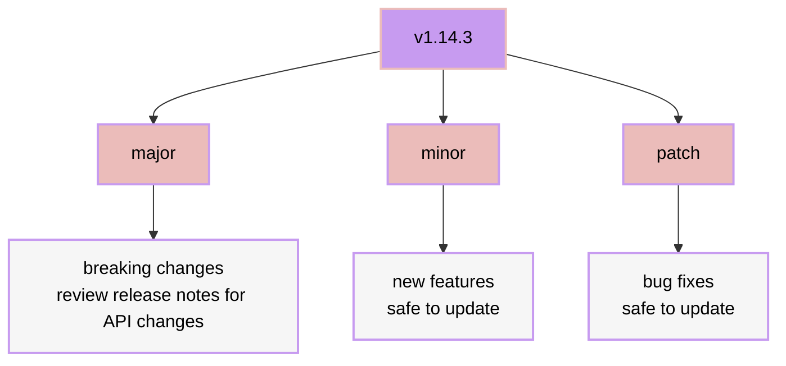

# upgrading

hydenix can be upgraded, downgraded, or version-locked easily from your template flake directory.

## upgrade to latest

```bash
nix flake update hydenix
sudo nixos-rebuild switch --flake .#hydenix
```

## pin a specific version

edit your `flake.nix` to target a branch, tag, or commit:

```nix
inputs = {
  nixpkgs.follows = "hydenix/nixpkgs";

  hydenix = {
    # latest stable (default)
    url = "github:ClementBobin/hydenix";

    # dev branch
    # url = "github:ClementBobin/hydenix/dev";

    # specific release tag
    # url = "github:ClementBobin/hydenix/v1.14.3";

    # specific commit
    # url = "github:ClementBobin/hydenix/<commit-hash>";
  };
};
```

then run `nix flake update hydenix` and rebuild.

## when to upgrade



> [!IMPORTANT]
> - **always review [release notes](https://github.com/ClementBobin/hydenix/releases) before major updates** — these may contain breaking API changes
> - minor and patch updates are safe to apply at any time

## rolling back

NixOS keeps previous generations. if an upgrade breaks something:

```bash
# list available generations
sudo nix-env --list-generations --profile /nix/var/nix/profiles/system

# roll back to the previous generation
sudo nixos-rebuild switch --rollback
```
